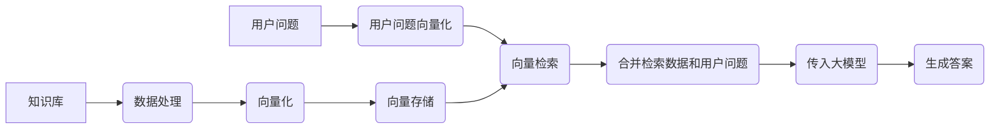

# 基于RAG的法律条文智能助手

## 📖 项目简介

本项目 LexRAGen 旨在构建一个高效、精确且可解释的法律条文智能问答系统。通过结合 检索增强生成 (RAG) 技术与 LoRa 微调 方法，我们致力于解决传统问答系统在处理法律领域复杂性、知识时效性以及答案溯源方面的挑战。

本项目的核心价值在于：

*   动态更新: 能够支持法律条文知识库的按月更新，确保信息的时效性。
*   精准引用: 系统能够精准引用原始法律条文，并提供详细的出处信息（如法律名称、条款号、文件来源）。
*   复杂查询处理: 有效处理劳动纠纷等场景中的复杂法律查询，进行多条款关联分析。
*   高准确性与可解释性: 利用 RAG 直接引用原文，避免大模型生成偏差；提供条款溯源，增强答案的可信度和法律严谨性。

与纯粹基于大模型微调的方案相比，RAG 方案在数据更新频率、内容准确性、知识覆盖范围和可解释性方面展现出显著优势：

| 对比维度     | RAG 方案             | 微调方案                     |
| :----------- | :------------------- | :--------------------------- |
| 数据更新频率 | 支持动态更新知识库   | 需要重新标注并训练模型       |
| 内容准确性   | 直接引用原文，避免生成失真 | 依赖标注质量，易产生偏差     |
| 知识覆盖范围 | 适合大规模知识体系   | 需要海量标注数据             |
| 可解释性     | 支持条款溯源，符合法律严谨性 | 黑盒模型，解释性差           |

## ✨ 主要功能与特性

*   基于法律条文知识库的智能问答。
*   对回答中引用的法律条文进行溯源，显示法律名称、条款、来源文件及相关度得分。
*   支持法律条文知识库的动态更新（理论上可实现定时爬取与自动化解析）。
*   结合使用 RAG 框架与针对特定问题（如主体区分）的 LoRa 领域微调。
*   提供基于 Streamlit 的交互式 Web 用户界面。

## 🛠️ 技术栈

*   大语言模型 (LLM): Qwen1.5-4B-Chat (基座模型)
*   嵌入模型 (Embedding Model): text2vec-base-chinese-sentence
*   检索模型/重排序模型 (Rerank Model): BAAI/bge-reranker-large
*   RAG 框架: LlamaIndex
*   向量数据库: ChromaDB (PersistentClient)
*   前端框架: Streamlit
*   微调技术: LoRa (Low-Rank Adaptation)
*   数据处理: Python, BeautifulSoup, re
*   开发环境: Windows11 + WSL2-Linux-Ubuntu22.04
*   硬件需求: 建议配置 GeForce RTX 4060 Ti 16GB 或更高

## 架构与工作流程

本项目采用经典的 RAG 架构，通过外部知识检索增强大模型的生成能力。LoRa 微调用于优化基础模型在特定法律领域问题的理解和处理。

整体问答流程:

```
用户提问 -> 问题解析 -> RAG 检索 -> 生成答案 -> 引用溯源
```

RAG 详细工作流程图:



在这个流程中，用户问题经过向量化后，在向量数据库中检索最相关的法律条文向量。检索到的原始法律条文（可能经过重排序优化）与用户问题一起作为上下文输入给大语言模型，由模型生成回答并引用相应的条文。

## 📂 项目结构

项目的目录结构组织如下：

```
LexRAGen/
├── main.py             # 主程序入口，可能包含核心逻辑或调用其他模块
├── web_ui.py           # Streamlit 前端界面的实现
├── requirements.txt    # 项目依赖库列表
├── data/               # 存放原始或处理后的法律条文数据文件
├── chroma_db/          # ChromaDB 向量数据库持久化存储目录
├── storage/            # LlamaIndex 索引或其他持久化存储目录
└── core/               # 存放项目核心代码模块
    ├── config.py       # 项目配置文件，如模型路径、数据库配置等
    ├── models.py       # 大模型、Embedding模型、Reranker模型的初始化与加载
    ├── data_processor.py # 负责数据的清洗、规范化和节点构建
    ├── vector_store.py # 管理向量数据库的存储、加载和检索操作
    ├── evaluators.py   # 项目评估相关的代码，如召回率、命中率计算
    └── benchmark_data.py # 存放用于评估测试的数据集
```

## 📚 数据处理

1.  源数据获取: 法律条文数据通过爬取政府相关法律网站获取。
2.  清洗与整理: 使用 Python 的 `re` 模块和 `BeautifulSoup` 对爬取的文本进行清洗，提取出独立的法律条款内容及其对应的编号。
3.  规范化: 将提取的条款整理成结构化的 JSON 格式，其中键为“法律名称 第XX 条”，值为条款内容。
    例如：
    ```json
    {
        "中华人民共和国劳动法 第36 条": "用人单位因生产经营需要 ...",
        "中华人民共和国劳动合同法 第10 条": "建立劳动关系应当订立书面劳动合同 ..."
    }
    ```
4.  向量嵌入: 使用 `text2vec-base-chinese-sentence` 嵌入模型将规范化后的法律条文文本（封装为 LlamaIndex 的 `TextNode` 对象）转换为高维向量。
5.  向量存储: 利用 ChromaDB 向量数据库存储这些向量及其对应的原始文本信息，实现高效的相似度检索。
6.  语义重排: 在初步向量检索得到 TopK 文档后，使用 `BAAI/bge-reranker-large` 模型根据问题对这些文档进行二次排序，提升最相关文档的排名，输入给 LLM 的上下文更聚焦。

## 🖥️ 用户界面

项目通过 Streamlit 构建了一个直观易用的 Web 界面，提供聊天式的交互体验。

*   用户可以在输入框中提问法律相关问题。
*   系统以聊天气泡的形式展示助手的回答。
*   如果助手回答中包含模型思考过程（通过特定标记识别），界面支持显示这部分内容。
*   通过专门的功能 (`_show_reference_details`)，界面能够详细展示回答所依据的法律条款，包括来源文件、法律名称、初始检索得分、重排序得分以及引用条文的关键内容片段，增强答案的可解释性和可信度。

## 🚀 安装与运行

本项目依赖于 Python 环境以及 `requirements.txt` 中列出的库。建议在具备一定显存的 GPU 环境下运行，以获得更好的性能。

1.  克隆仓库:
    ```bash
    git clone https://github.com/ismoyuai/LexRAGen.git
    cd LexRAGen
    ```
2.  安装依赖:
    ```bash
    pip install -r requirements.txt
    ```
3.  数据准备: 确保法律条文数据已按照项目要求处理并存放在 `data/` 目录下。
4.  模型下载: 项目使用的模型 (Qwen1.5-4B-Chat, text2vec-base-chinese-sentence, BAAI/bge-reranker-large) 需要预先下载。请根据 `core/config.py` 中的配置指定模型路径。
5.  配置: 检查并修改 `core/config.py` 文件，配置模型路径、向量数据库路径等。
6.  构建知识库索引: 运行数据处理和索引构建脚本（具体命令请参考项目源码或后续文档），生成 `chroma_db/` 和 `storage/` 目录中的索引文件。
7.  运行:
    *   运行主程序 (如果 `main.py` 是可执行入口):
        ```bash
        python main.py
        ```
    *   运行 Streamlit Web UI (如果 `web_ui.py` 是前端入口):
        ```bash
        streamlit run web_ui.py
        ```

*注: 以上安装与运行步骤为通用指南，具体命令请参考项目代码中的详细说明或补充文档。*

## ✅ 评估指标与成果

项目通过以下指标对系统性能进行了评估：

*   重排序召回率 (Rerank Recall): 衡量重排序步骤将标准答案相关的条款排到 TopK 结果中的能力。
*   端到端条款命中率 (End-to-End Clause Hit Rate): 衡量从用户问题到最终生成回答的整个 RAG 流程能否命中标准答案中要求的关键法律条款。

当前评估结果:

*   重排序召回率： 94.7%
*   端到端条款命中率： 83.3%

这些评估结果表明系统在准确引用法律条文方面达到了可交付的要求。

## 🔬 LoRa 微调的应用

在本项目中，LoRa (Low-Rank Adaptation) 微调技术主要用于针对基础大模型在处理特定法律领域细微问题时的不足进行定向修复。例如，通过构建小规模、有针对性的微调数据集（如区分“用人单位解除”和“劳动者解除”劳动合同的不同法律条文），对基础 LLM 进行微调，使其能更准确地理解问题中的主体和语境，从而在 RAG 流程中更好地利用检索到的信息。

微调采用的 LoRa 参数配置示例：`r=32`, `lora_alpha=64`, `target_modules=["q_proj", "v_proj"]`。

## 🛣️ 未来展望

未来的工作和潜在的优化方向包括：

*   更换更大参数量的 LLM: 实践表明，对于复杂的提示词约束，参数量更大的模型能更好地理解和遵循指令，有望进一步提升回答质量。
*   优化数据处理流程: 提高数据爬取、清洗和更新的自动化程度。
*   增强复杂推理能力: 探索更高级的 RAG 策略或结合其他技术，以处理需要更深层次法律推理的复杂问题。
*   扩展知识库: 纳入更多法律法规、司法解释、典型案例等，丰富问答系统的知识覆盖范围。

## 🔗 参考资料

*   LlamaIndex 官方文档
*   LLM 模型 (基于 ModelScope 平台下载)
*   LMDeploy (推理框架参考)
*   Streamlit 官方文档
